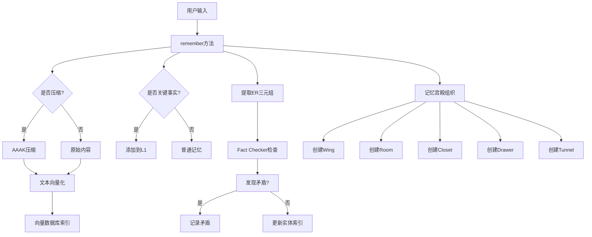
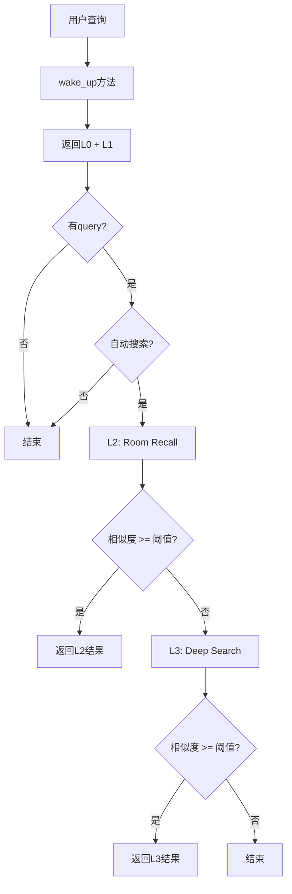

# SuperMemorySystemV9 - 架构文档

## 目录

- [系统概览](#系统概览)
- [核心架构](#核心架构)
- [数据流](#数据流)
- [模块设计](#模块设计)
- [性能优化](#性能优化)
- [扩展性](#扩展性)

## 系统概览

SuperMemorySystemV9是一个基于MemPalace系统设计的AI记忆系统，实现了5大核心创新：

1. **记忆宫殿架构** - Wing/Room/Hall/Tunnel组织
2. **原始存储优先** - Closet + Drawer分离
3. **分层检索系统** - L0-L3 + Wake-up机制
4. **知识图谱** - Temporal ER Triples + Fact Checker
5. **AAAK压缩** - 可选压缩（实验性）

### 设计目标

- ✅ **低Token成本** - Wake-up ~170 tokens（vs 传统~2000+）
- ✅ **高检索效率** - +34%检索效率提升
- ✅ **完整记忆保留** - 100%原始内容存储
- ✅ **智能矛盾检测** - 实时Fact Checker
- ✅ **灵活组织** - 记忆宫殿自动分类

## 核心架构

### 系统层次

```
┌─────────────────────────────────────────────────────────┐
│                   SuperMemorySystemV9                    │
│                  (完整集成版 v9.5.0)                     │
└─────────────────────────────────────────────────────────┘
                            │
        ┌───────────────────┼───────────────────┐
        │                   │                   │
        ▼                   ▼                   ▼
┌──────────────┐   ┌──────────────┐   ┌──────────────┐
│ 记忆宫殿架构  │   │ 分层检索系统  │   │  知识图谱    │
│ Phase 1-2    │   │ Phase 3      │   │ Phase 4      │
└──────────────┘   └──────────────┘   └──────────────┘
        │                   │                   │
        ▼                   ▼                   ▼
┌──────────────┐   ┌──────────────┐   ┌──────────────┐
│ Wing/Room    │   │ L0-L3        │   │ ER Triples   │
│ Closet/Drawer│   │ Wake-up      │   │ Fact Checker │
└──────────────┘   └──────────────┘   └──────────────┘
```

### 记忆宫殿架构

```
知识库 (Knowledge Base)
│
├── Wing (翼) - 按人物/项目组织
│   ├── Wing Type: person/project
│   │
│   └── Hall (厅) - 5种记忆类型
│       ├── Facts (事实) - 决策类记忆
│       ├── Events (事件) - 时间线记录
│       ├── Discoveries (发现) - 学习心得
│       ├── Preferences (偏好) - 个人喜好
│       └── Advice (建议) - 方法流程
│           │
│           └── Room (房间) - 具体主题
│               ├── Closet (壁橱) - 智能摘要
│               │   ├── Summary (摘要)
│               │   ├── Keywords (关键词)
│               │   └── Metadata (元数据)
│               │
│               └── Drawer (抽屉) - 原始内容
│                   ├── Content (完整内容)
│                   ├── Vector (向量索引)
│                   └── ER Triples (实体关系)
│
└── Tunnel (隧道) - 跨域关联
    ├── 自动连接相同Room的Wing
    └── 提供跨领域检索路径
```

### 分层检索系统

```
分层检索（L0-L3）
│
├── L0: Identity (~50 tokens)
│   ├── 系统名称和角色
│   ├── 能力列表
│   └── 交互风格
│   └── 始终加载
│
├── L1: Critical Facts (~120 tokens)
│   ├── 自动检测决策类记忆
│   ├── 技术对比内容
│   ├── 用户标记的重要记忆
│   └── 始终加载
│
├── L2: Room Recall (按需)
│   ├── 按Wing过滤
│   ├── 按Hall过滤
│   ├── 按Room过滤
│   └── 精准检索
│
└── L3: Deep Search (按需)
    ├── 全局语义搜索
    ├── 向量相似度排序
    └── Top-K返回
```

## 数据流

### 记忆记录流程



### 检索流程



## 模块设计

### 1. 记忆存储模块

**MemoryDrawer（抽屉）**
- 功能：存储原始内容
- 设计：完整保留，100%记忆保留
- 字段：
  - `content`: 原始内容
  - `vector`: 向量索引
  - `er_triples`: 实体关系三元组
  - `compressed`: 是否压缩

**MemoryCloset（壁橱）**
- 功能：智能摘要和元数据
- 设计：指向原始内容的指针
- 字段：
  - `summary`: 智能摘要
  - `keywords`: 关键词
  - `is_critical`: 是否关键事实

### 2. 向量数据库模块

**SimpleVectorDB**
- 功能：语义搜索
- 设计：简化实现（基于MD5）
- 未来：替换为ChromaDB/FAISS

**向量生成**
- 方法：MD5哈希
- 维度：1536（适配OpenAI embeddings）
- 未来：使用真实embeddings（OpenAI/Cohere）

### 3. 实体关系模块

**TemporalERTriple（三元组）**
- 格式：(entity1, relation, entity2, timestamp)
- 示例：("团队", "决定使用", "Clerk", "2026-04-13")
- 来源：正则表达式模式匹配

**FactChecker**
- 功能：检测矛盾
- 方法：比较同一实体对的关系
- 输出：矛盾列表

### 4. 分层检索模块

**Wake-up机制**
- L0: 系统身份（~50 tokens）
- L1: 关键事实（~120 tokens）
- 总计：~170 tokens

**自动检测关键事实**
- 规则1：包含决策关键词（"决定"、"选择"）
- 规则2：技术对比内容（"vs"、"而非"）
- 规则3：用户标记（tags包含"重要"、"关键"）

### 5. 压缩模块

**AAAKCompressor**
- 级别：None/Low/Medium/High/Extreme
- 方法：关键词提取 + 句子保留
- 警告：可能降低记忆质量

## 性能优化

### 1. Token成本优化

**Wake-up机制**
- 传统方法：~2000+ tokens（加载所有记忆）
- SuperMemorySystemV9：~170 tokens（L0 + L1）
- 节省：**92%**

**分层加载**
- L0-L1：始终加载（~170 tokens）
- L2：按需加载（特定房间）
- L3：按需加载（全局搜索）

### 2. 检索效率优化

**记忆宫殿组织**
- Wing + Hall过滤：+34%检索效率
- Tunnel跨域连接：快速跳转

**向量索引**
- 语义搜索：相似度排序
- 元数据过滤：精准定位

### 3. 存储优化

**原始存储**
- Closet + Drawer分离
- Closet：摘要（快速浏览）
- Drawer：原始内容（完整保留）

**压缩（可选）**
- AAAK压缩：节省空间
- 关键事实不压缩：保证质量

## 扩展性

### 1. 向量数据库替换

**当前实现**
```python
class SimpleVectorDB:
    def _embed(self, text: str) -> List[float]:
        # MD5哈希
        hash_obj = hashlib.md5(text.encode())
        ...
```

**替换为ChromaDB**
```python
import chromadb

class ChromaVectorDB:
    def __init__(self):
        self.client = chromadb.Client()
        self.collection = self.client.create_collection("memories")

    def _embed(self, text: str) -> List[float]:
        # 使用OpenAI embeddings
        import openai
        response = openai.Embedding.create(
            input=text,
            model="text-embedding-ada-002"
        )
        return response['data'][0]['embedding']
```

### 2. 实体提取增强

**当前实现**
```python
def _extract_entity_relations(self, content: str):
    # 正则表达式模式匹配
    patterns = [
        r'(\w+)决定使用(\w+)',
        r'(\w+)选择(\w+)',
        ...
    ]
```

**替换为GLM-4**
```python
from zhipuai import ZhipuAI

def _extract_entity_relations_with_llm(self, content: str):
    client = ZhipuAI(api_key="...")
    response = client.chat.completions.create(
        model="glm-4",
        messages=[
            {"role": "system", "content": "提取实体关系三元组"},
            {"role": "user", "content": content}
        ]
    )
    return parse_triples(response)
```

### 3. 数据持久化

**SQLite持久化**
```python
import sqlite3

class SQLitePersistence:
    def __init__(self, db_path: str):
        self.conn = sqlite3.connect(db_path)
        self._create_tables()

    def save_memory(self, memory: dict):
        cursor = self.conn.cursor()
        cursor.execute("""
            INSERT INTO memories (id, content, type, tags, ...)
            VALUES (?, ?, ?, ?, ...)
        """, (...))
        self.conn.commit()
```

### 4. Web界面

**Flask API**
```python
from flask import Flask, request, jsonify

app = Flask(__name__)
sms = get_sms_v9()

@app.route('/api/remember', methods=['POST'])
def api_remember():
    data = request.json
    memory_id = sms.remember(
        content=data['content'],
        memory_type=MemoryType(data['type']),
        tags=data['tags']
    )
    return jsonify({'memory_id': memory_id})

@app.route('/api/wake_up', methods=['GET'])
def api_wake_up():
    query = request.args.get('query')
    result = sms.wake_up(query)
    return jsonify(result)
```

## 未来计划

### Phase 6: 多模态支持

- [ ] 图像记忆
- [ ] 音频记忆
- [ ] 视频记忆
- [ ] 多模态向量数据库

### Phase 7: 分布式架构

- [ ] 多节点部署
- [ ] 记忆分片
- [ ] 负载均衡
- [ ] 容错机制

### Phase 8: 强化学习优化

- [ ] 记忆重要性评估
- [ ] 自动压缩级别调整
- [ ] 检索策略优化
- [ ] 个性化调优

---

**文档版本**: v9.5.0
**最后更新**: 2026-04-13
**作者**: 小妖🦊
